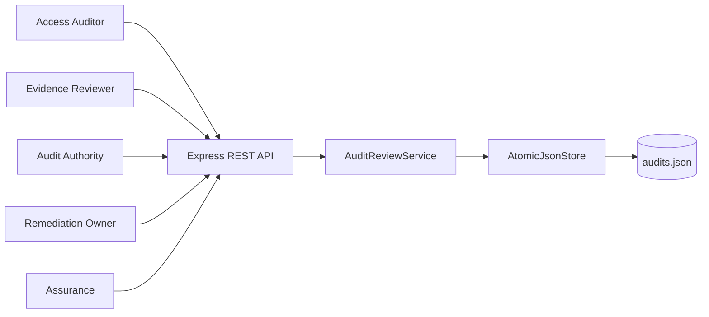
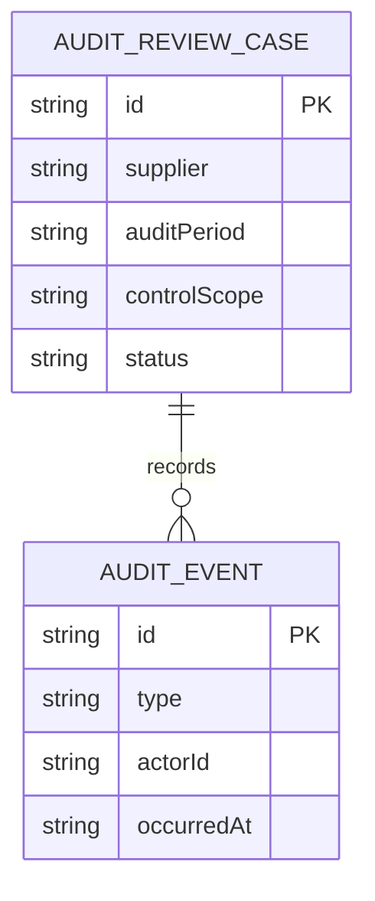
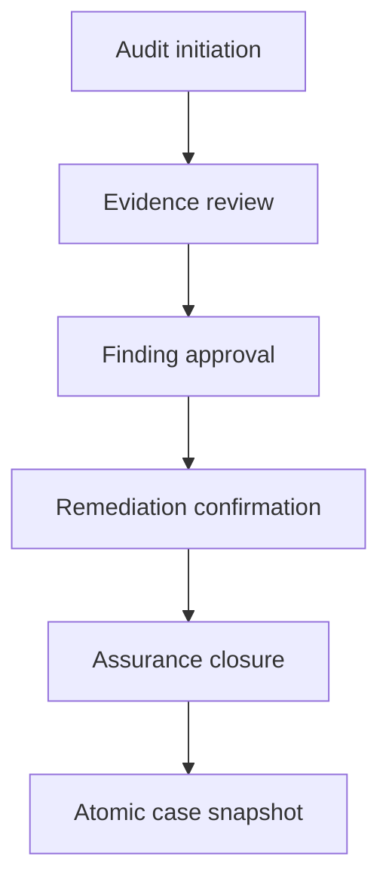
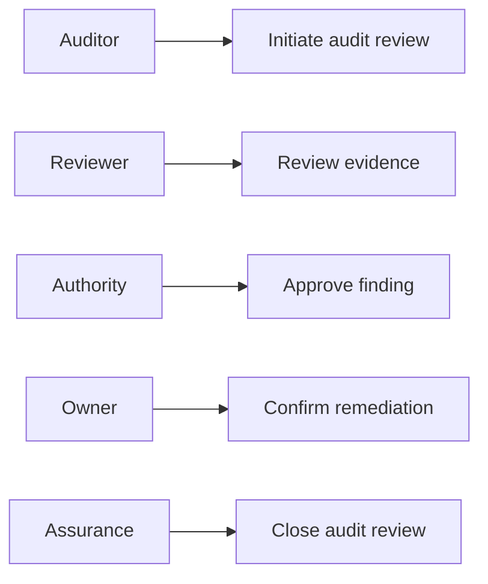
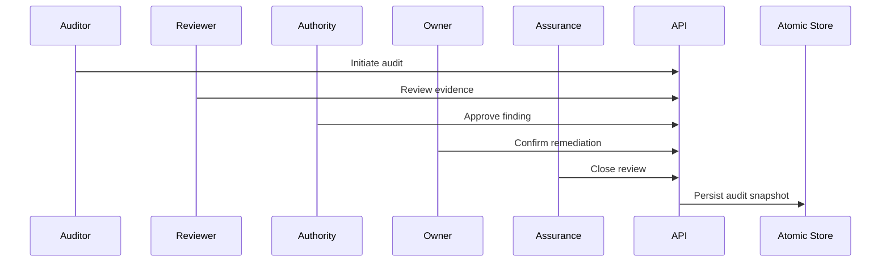

# Supplier Evidence Access Audit Review Platform

## The Problem

Supplier evidence access audits lose accountability when initiation, evidence review, finding approval, remediation confirmation, and closure are handled through disconnected records. The organisation cannot easily show how an access finding was evaluated and resolved.

## The Solution

This service controls access audit reviews through auditor initiation, evidence review, authority approval, remediation confirmation, and assurance closure. Each transition verifies role ownership and predecessor state, records an audit event, and persists the full case atomically.

## Live Demo and Tech Stack

Start the service and visit `http://localhost:64300/health` to confirm readiness. The stack uses Node.js 22, Express 5, ESM JavaScript, atomic JSON persistence, Vitest, and GitHub Actions.

| Layer | Implementation | Responsibility |
| --- | --- | --- |
| HTTP API | Express 5 | Audit lifecycle routes and errors |
| Control domain | ESM JavaScript | Role gates, state progression, and audits |
| Persistence | Node file system | Temporary snapshot and atomic rename |
| Verification | Vitest and GitHub Actions | Tests and continuous integration |

## Local Setup and Run Instructions

```bash
git clone https://github.com/kholipha-ahmmad-al-amin/supplier-evidence-access-audit-review-platform.git
cd supplier-evidence-access-audit-review-platform
npm install
npm test
npm start
```

The service binds to `0.0.0.0:64300` for approved local area network use.

## System Documentation

### System Architecture Diagram


### Entity-Relationship Diagram


### Data Flow Diagram


### Use Case Diagram


### Sequence Diagram


## Owner

Created and maintained by Kholipha Ahmmad Al-Amin.

Software Engineer and AI Specialist

Founder and CEO of EquiSaaS BD

Principal Consultant at AR IT Consultancy

Full Stack Developer and SaaS Product Builder

### Official links

Portfolio: https://kholipha-ahmmad-al-amin.equisaas-bd.com/

GitHub: https://github.com/kholipha-ahmmad-al-amin

LinkedIn: https://www.linkedin.com/in/kholipha-ahmmad-al-amin

X: https://x.com/al_amin5519

Facebook: https://www.facebook.com/kholipha.ahmmad.al.amin

Instagram: https://www.instagram.com/kholipha.ahmmad.al.amin

## Ownership

This project was created and is maintained by Kholipha Ahmmad Al-Amin.
